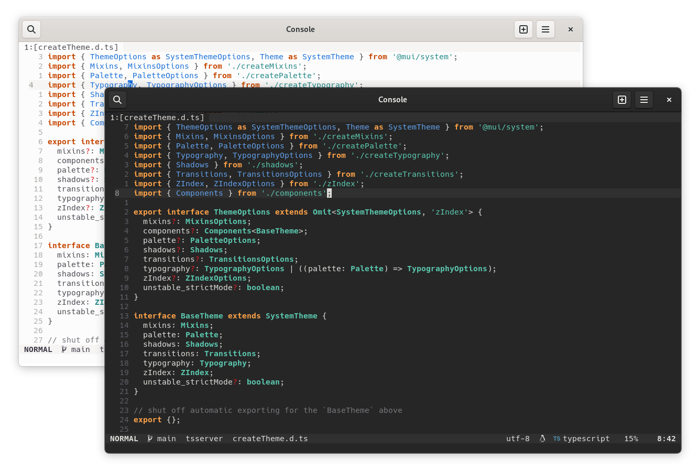

<h1 align="center">Adwaita.nvim</h1>

Neovim colorscheme using Gnome Adwaita syntax



## Supported Plugins

- [Git Gutter](https://github.com/airblade/vim-gitgutter)
- [Git Signs](https://github.com/lewis6991/gitsigns.nvim)
- [LSP](https://github.com/neovim/nvim-lspconfig)
- [Lualine](https://github.com/hoob3rt/lualine.nvim)
- [NvimTree](https://github.com/kyazdani42/nvim-tree.lua)
- [Telescope](https://github.com/nvim-telescope/telescope.nvim)
- [Treesitter](https://github.com/nvim-treesitter/nvim-treesitter)
- [nvim-cmp](https://github.com/hrsh7th/nvim-cmp)
- [nvim-compe](https://github.com/hrsh7th/nvim-compe)

## ⬇️ Installation

> This colorscheme requires [nvim-treesitter](https://github.com/nvim-treesitter/nvim-treesitter)

Install via package manager

```lua
-- Packer:
use 'Mofiqul/adwaita.nvim'
```

```vim
" Vim-Plug:
Plug 'Mofiqul/adwaita.nvim'
```

## 🚀 Usage

```lua
-- Lua:
vim.g.adwaita_darker = true -- for darker version
vim.g.adwaita_disable_cursorline = true -- to disable cursorline
vim.g.adwaita_transparent = true -- makes the background transparent
vim.cmd([[colorscheme adwaita]])
```

```vim
" Vim-Script:
let g:adwaita_darker = v:true " for darker version
let g:adwaita_disable_cursorline = v:true " to disable cursorline
let g:adwaita_transparent = v:true " makes the background transparent
colorscheme adwaita
```

If you are using [`lualine`](https://github.com/hoob3rt/lualine.nvim), you can also enable the provided theme:

```lua
require("lualine").setup({
    options = {
        -- ...
        theme = "adwaita",
        -- ...
    },
})
```

## Something is broken but I know how to fix it!

Pull requests are welcome! Feel free to send one with an explanation!

